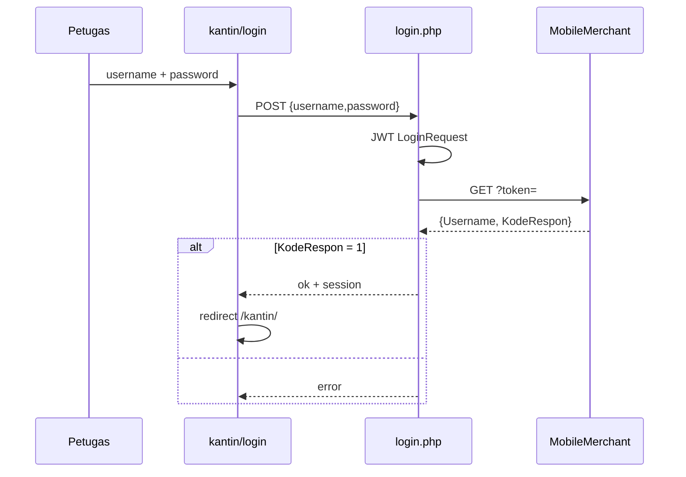
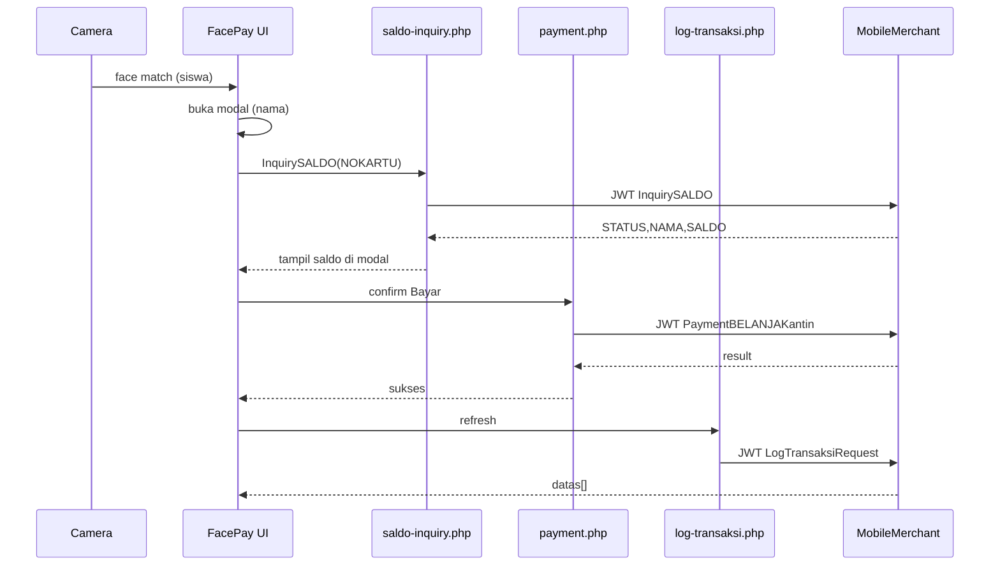

# Design Spec — Facepay Alizzah (Redesign Portal · Admin · Kantin)

> Spec ini mengikuti struktur **design.md / MCP** agar bisa dibaca agent, designer, dan developer secara konsisten.
> Produk: Facepay Alizzah · Brand: **Alizzah** (bukan Alislam).

---

## 0. Meta

| Field | Value |
|-------|--------|
| `product` | Facepay Alizzah |
| `version` | `2.0.0-redesign` |
| `status` | implemented (P0–P3) — uji manual di server |
| `owner` | ICT Alizzah |
| `locale` | `id-ID` |
| `stack` | HTML/CSS/JS + PHP API proxy + MySQL |
| `merchant_api` | `http://103.23.103.43/MobileMerchant/Malang_Alizzah_ForVPS/index.php` |
| `auth_jwt` | HS256 · secret dari `admin/api/config.php` → `jwt_secret` |
| `related_docs` | `docs/REDESIGN-KANTIN-ADMIN.md`, `docs/REKAM-WAJAH.md`, `docs/FACE-DETECTOR-ABSEN.md` |

### Goals redesign

1. **Portal utama** memisahkan jalur **Kantin** dan **Admin**.
2. **Login kantin** via MobileMerchant `LoginRequest` (JWT).
3. **Login admin** tetap dari tabel lokal `admin_user`.
4. **Kantin** = modul FacePay profesional + **log pembelian** dari `LogTransaksiRequest`.
5. FacePay: **deteksi wajah → modal nama → InquirySALDO → bayar `PaymentBELANJAKantin`**.
6. **Responsive** mobile → tablet → desktop.
7. Struktur folder & API rapi (proxy PHP, session terpisah).

### Non-goals (fase ini)

- Mengganti Face Detector absensi admin (tetap ada di panel admin).
- Portal ortu (tetap terpisah di `/ortu`).
- Offline FacePay tanpa API merchant.

---

## 1. Information Architecture

```
/                         → Portal pintu (pilih Kantin | Admin)
/kantin/login.html        → Login petugas kantin (API LoginRequest)
/kantin/index.html        → FacePay + log pembelian (setelah login kantin)
/admin/login.html         → Login admin (tabel admin_user)
/admin/index.html         → Dashboard admin (presensi, settings, rekam, dll.)
/ortu/                    → Portal ortu (tidak berubah di fase redesign)
```

### Role matrix

| Role | Auth source | Setelah login | Akses |
|------|-------------|---------------|--------|
| **Guest** | — | Portal `/` | Pilih jalur |
| **Kantin** | MobileMerchant `LoginRequest` | `/kantin/` | FacePay, log transaksi, logout |
| **Admin** | DB `admin_user` | `/admin/` | Semua modul admin + absensi + settings |
| **Ortu** | NIS (existing) | `/ortu/` | Rekam wajah anak |

### Session keys (pisah)

| Key | Scope | Isi |
|-----|--------|-----|
| `alizzah_kantin_session` | `sessionStorage` / cookie PHP | `{ username, displayName, loggedAt }` |
| `MAF_ADMIN` | PHP session (existing) | `admin_user_id` |

---

## 2. Design Tokens

### Brand & color

Arah visual: **sekolah / kantin modern**, bukan purple-AI default. Dominan hijau zaitun + charcoal + krem hangat.

```css
:root {
  /* Brand */
  --brand: #1f6b4a;           /* hijau Alizzah */
  --brand-deep: #134833;
  --brand-soft: #e6f2ec;
  --accent: #c45c26;          /* terracotta soft untuk CTA bayar */
  --accent-hover: #a84b1c;

  /* Neutrals */
  --ink: #14201a;
  --ink-muted: #5c6b63;
  --paper: #f7f5f1;
  --surface: #ffffff;
  --line: #d9e0db;
  --danger: #b42318;
  --ok: #1f7a4d;
  --warn: #b54708;

  /* Kantin / FacePay stage */
  --stage-bg: #0f1a15;
  --stage-glow: rgba(31, 107, 74, 0.35);

  /* Radius & shadow */
  --r-sm: 8px;
  --r-md: 14px;
  --r-lg: 22px;
  --shadow-1: 0 1px 2px rgba(20, 32, 26, 0.06);
  --shadow-2: 0 12px 40px rgba(20, 32, 26, 0.12);

  /* Type */
  --font-display: "Fraunces", Georgia, serif;
  --font-body: "DM Sans", system-ui, sans-serif;
}
```

### Typography scale

| Token | Size | Use |
|-------|------|-----|
| `display` | clamp(2rem, 5vw, 3.25rem) | Brand di portal |
| `h1` | 1.75rem | Judul halaman |
| `h2` | 1.25rem | Section |
| `body` | 1rem | Teks |
| `mono` | 0.875rem tabular | Nominal / saldo |

### Motion (2–3 intentional)

1. Portal: kartu Kantin/Admin fade-up + slight lift on hover.
2. FacePay modal: scale-in 180ms + backdrop.
3. Pay success: pulse ring hijau singkat pada video wrap.

---

## 3. Screens

### 3.1 Portal utama — `/index.html`

**Job:** satu viewport, brand dulu, dua jalur jelas.

**Layout (desktop)**
- Full-bleed background: gradien `#0f1a15` → `#1f6b4a` + foto atmosfer sekolah/kantin (opsional).
- Brand hero: **Facepay Alizzah** (display font).
- Satu kalimat: *Pembayaran wajah & panel pengelola.*
- Dua CTA besar berdampingan: **Masuk Kantin** · **Masuk Admin**.

**Layout (mobile)**
- Brand di atas, dua tombol full-width bertumpuk.
- Tidak ada cards-of-stats, tidak ada jadwal di hero.

**Wire (teks)**

```
┌─────────────────────────────┐
│     Facepay Alizzah         │
│  Pembayaran wajah sekolah   │
│                             │
│  [ Masuk Kantin  ]          │
│  [ Masuk Admin   ]          │
└─────────────────────────────┘
```

---

### 3.2 Login Kantin — `/kantin/login.html`

**Auth:** API `LoginRequest` (lihat §5.1).

**UI**
- Form: Username, Password, tombol **Masuk**.
- Error: `KodeRespon !== 1` → pesan "Username atau kata sandi salah".
- Sukses: simpan session `username` (dari response `Username`) → redirect `/kantin/index.html`.
- Link kecil: "Masuk sebagai Admin →".

**States:** idle · loading · error · success.

---

### 3.3 Login Admin — `/admin/login.html`

**Auth:** existing `admin_user` + `AdminAuth` / `admin-auth.js` (tidak diganti sumbernya).

**UI tweak**
- Brand "Facepay Alizzah — Panel Admin".
- Link: "Masuk sebagai Kantin →".

---

### 3.4 Kantin FacePay — `/kantin/index.html` (rombak total)

**Konsep:** workstation kasir — kamera besar, nominal jelas, log pembelian di samping (desktop) / di bawah (mobile).

#### Regions

| Region | Isi |
|--------|-----|
| **Top bar** | Logo mini + nama kantin (`Username` login) + Logout |
| **Nominal dock** | Input Rp + quick chips (+500…+5000 / −) + Mic opsional |
| **Stage kamera** | Video full-bleed area, overlay target wajah, status bar |
| **Pay modal** | Nama siswa · Saldo · Nominal · Konfirmasi / Batal |
| **Log pembelian** | Tabel dari `LogTransaksiRequest` (USERNAME = username login) |

#### Desktop (≥1024px)

```
┌─ Top bar: Alizzah Kantin · WS_TESTING · [Keluar] ─────────┐
├──────────────────────────────┬────────────────────────────┤
│ Nominal Rp [_____]  chips    │ Log pembelian hari ini     │
│ [Aktifkan kamera] [Stop]     │ Nama | Waktu | Nominal     │
│                              │ …                          │
│ ┌─ video stage ──────────┐   │ [Muat ulang log]           │
│ │  face target + saldo   │   │                            │
│ └────────────────────────┘   │                            │
└──────────────────────────────┴────────────────────────────┘
```

#### Mobile (<768px)

```
Top bar
Nominal dock (sticky)
Video stage (aspect 3/4)
Tombol kamera
Log pembelian (accordion / sheet)
```

#### FacePay interaction flow (wajib)

```
1. Petugas set NOMINAL (> 0)
2. Aktifkan kamera → face-api matching (foto referensi dari DB)
3. Face MATCH
   → tampilkan MODAL:
        Nama (dari match / InquirySALDO.NAMA)
        → panggil InquirySALDO (NOKARTU = NIS siswa)
        → tampilkan SALDO
        → tampilkan NOMINAL yang akan didebit
        [Bayar] [Batal]
4. Bayar → PaymentBELANJAKantin
        NOKARTU, NOMINAL, NAMAKANTIN = username login kantin
5. Sukses → tutup modal, refresh log (LogTransaksiRequest), cooldown
6. Gagal → toast error, kamera tetap siap
```

**Catatan UX**
- Modal muncul **setelah** wajah dikenali; InquirySALDO dipanggil **sebelum** konfirmasi bayar.
- Jangan auto-debit tanpa konfirmasi petugas (kecuali mode “auto” nanti — default: konfirmasi).
- Cooldown ~5 detik per siswa setelah transaksi sukses.
- Hands/gestur: **opsional** di redesign (boleh disederhanakan dulu: wajah + konfirmasi modal).

---

### 3.5 Admin home — `/admin/index.html`

Panel admin (tema terang Alizzah):

- Hero welcome hijau brand
- Tile akses cepat: Presensi wajah, Rekam, Data siswa, Portal Kantin
- Bottom nav: Beranda · Modul · Pengaturan
- FacePay produksi diarahkan ke `/kantin` (modul lama `modules/facepay.html` tetap ada untuk uji)

---

## 4. Components (MCP inventory)

| ID | Component | Props / notes |
|----|-----------|---------------|
| `C-PortalHero` | Brand + 2 CTA | `brand`, `ctaKantin`, `ctaAdmin` |
| `C-AuthCard` | Kartu login | `title`, `subtitle`, `onSubmit`, `error` |
| `C-TopBar` | Bar aplikasi | `brand`, `userLabel`, `onLogout` |
| `C-NominalDock` | Input + chips + mic | `value`, `min`, `onChange` |
| `C-CameraStage` | Video + overlay | `status`, `matchedName`, `saldoHint` |
| `C-PayConfirmModal` | Konfirmasi FacePay | `nama`, `saldo`, `nominal`, `loading`, `onConfirm`, `onCancel` |
| `C-TxnLogTable` | Log pembelian | `rows[]`, `empty`, `onRefresh` |
| `C-Toast` | Feedback singkat | `kind: ok\|warn\|danger` |
| `C-StatusPill` | Status kamera/model | `text`, `tone` |

### Modal FacePay (detail)

```
┌────────────────────────────────┐
│  Konfirmasi pembayaran         │
│                                │
│  Nama   FARREL GANTENG         │
│  Saldo  Rp 27.900              │
│  Bayar  Rp 100                 │
│                                │
│  [ Batal ]     [ Bayar sekarang ] │
└────────────────────────────────┘
```

Loading state pada tombol Bayar saat `PaymentBELANJAKantin` in-flight.
Jika saldo < nominal → disable Bayar + pesan "Saldo tidak cukup".

---

## 5. API Contracts (MobileMerchant JWT)

Semua request:

```
GET {api_url}?token={jwt}
```

JWT header:

```json
{ "typ": "JWT", "alg": "HS256" }
```

Payload = JSON claims sesuai METHOD. Signature HMAC-SHA256 dengan `jwt_secret`.

**Proxy rule:** browser **tidak** memanggil merchant langsung (CORS/secret). Semua lewat PHP di `admin/api/` atau `kantin/api/`.

Update `config.php`:

```php
'api_url' => 'http://103.23.103.43/MobileMerchant/Malang_Alizzah_ForVPS/index.php',
'allowed_methods' => [
  'LoginRequest',
  'InquirySALDO',
  'PaymentBELANJAKantin',
  'LogTransaksiRequest',
  'StudentRequest', // admin sync tetap
],
```

---

### 5.1 Login kantin — `LoginRequest`

**Claims**

```json
{
  "METHOD": "LoginRequest",
  "USERNAME": "farrelep",
  "PASSWORD": 123
}
```

**Response sukses (gambar 5)**

```json
{
  "Username": "ict test",
  "KodeRespon": 1
}
```

| Field | Arti |
|-------|------|
| `KodeRespon === 1` | Login OK |
| `Username` | Nama tampilan / ID sesi kantin (pakai untuk `NAMAKANTIN` & log) |

**Proxy:** `POST /kantin/api/login.php` body `{ username, password }` → JWT → merchant → session.

---

### 5.2 Inquiry saldo — `InquirySALDO`

**Claims**

```json
{
  "METHOD": "InquirySALDO",
  "NOKARTU": 1301154344
}
```

`NOKARTU` = NIS / nomor kartu siswa (angka).

**Response (gambar 4)**

```json
[
  {
    "STATUS": "OK",
    "NAMA": "FARREL GANTENG",
    "SALDO": "27900"
  }
]
```

**Proxy:** `POST /kantin/api/saldo-inquiry.php` `{ nokartu }` atau `{ siswaId }`.

Pakai di modal FacePay **sebelum** bayar.

---

### 5.3 Pembayaran FacePay — `PaymentBELANJAKantin`

**Claims (gambar 2)**

```json
{
  "METHOD": "PaymentBELANJAKantin",
  "NOKARTU": 1301154344,
  "NOMINAL": 100,
  "NAMAKANTIN": "WS_TESTING"
}
```

| Field | Sumber |
|-------|--------|
| `NOKARTU` | NIS siswa (hasil face match) |
| `NOMINAL` | Input petugas |
| `NAMAKANTIN` | **Username dari login kantin** (session) |

**Proxy:** `POST /kantin/api/payment.php` `{ nokartu, nominal }` — server mengisi `NAMAKANTIN` dari session (jangan percaya client).

---

### 5.4 Log pembelian — `LogTransaksiRequest`

**Claims (gambar 6)**

```json
{
  "METHOD": "LogTransaksiRequest",
  "USERNAME": "WS_TESTING"
}
```

`USERNAME` = username login kantin aktif.

**Response (gambar 7)**

```json
{
  "datas": [
    {
      "NamaCust": "FARREL GANTENG",
      "TRXDATE": "2026-06-04 17:28:40",
      "KANTIN": "WS_TESTING",
      "Nominal": "100"
    }
  ]
}
```

**UI mapping**

| API | Kolom tabel |
|-----|-------------|
| `NamaCust` | Nama |
| `TRXDATE` | Waktu |
| `KANTIN` | Kantin |
| `Nominal` | Nominal (format Rp) |

**Proxy:** `GET /kantin/api/log-transaksi.php` (USERNAME dari session).

---

## 6. Flows (sequence)

### 6.1 Login kantin



### 6.2 FacePay bayar



---

## 7. Folder structure (rapi)

```
/
  index.html                 # Portal
  design.md                  # Spec ini
  docs/
    REDESIGN-KANTIN-ADMIN.md # Dokumentasi teknis
    REKAM-WAJAH.md
    FACE-DETECTOR-ABSEN.md

  kantin/
    login.html
    index.html               # FacePay + log
    css/kantin.css
    js/
      kantin-auth.js
      kantin-facepay.js
      kantin-log.js
    api/
      login.php
      logout.php
      me.php
      saldo-inquiry.php
      payment.php
      log-transaksi.php
      bootstrap.php          # session kantin + reuse Merchant client

  admin/                     # existing, tetap
    login.html
    index.html
    modules/face.html        # absensi
    api/…                    # sync siswa, rekam, admin auth
```

Shared:

- `admin/api/lib/MobileMerchantClient.php` — perlu izinkan METHOD baru.
- Face models / `rekam-service` — kantin boleh load foto referensi via proxy yang sama (`rekam-data.php?withFoto=1`) dengan auth kantin session **atau** endpoint read-only khusus.

---

## 8. Responsive breakpoints

| Name | Width | Behavior |
|------|-------|----------|
| `sm` | < 640px | Single column; log di bawah kamera; CTA full width |
| `md` | 640–1023px | Nominal + kamera stacked; log collapsible |
| `lg` | ≥ 1024px | Split 60/40 kamera \| log |
| `xl` | ≥ 1280px | Max content width 1200–1280px centered |

Aturan:

- Touch target ≥ 44px.
- Video `playsinline`; jangan auto-fullscreen di iOS.
- Modal full-screen sheet di `sm`, centered dialog di `lg`.
- Tabel log: horizontal scroll di mobile, atau card-list.

---

## 9. Accessibility & security

- Form login: label nyata, `autocomplete`, error `role="alert"`.
- Modal: focus trap, Esc = batal, `aria-modal`.
- Password tidak pernah masuk log client.
- `NAMAKANTIN` / `USERNAME` log **hanya** dari server session.
- Rate-limit proxy payment (opsional): 1 req / 2s per session.
- HTTPS wajib di production (kamera + cookie secure).

---

## 10. Implementation phases

| Phase | Deliverable |
|-------|-------------|
| **P0** | Portal `/` + login kantin API + session + skeleton `/kantin/` |
| **P1** | FacePay UI baru + InquirySALDO modal + PaymentBELANJAKantin |
| **P2** | Log pembelian `LogTransaksiRequest` + refresh setelah bayar |
| **P3** | Polish responsive, motion, empty/error states, docs final |
| **P4** | Admin login link polish + config URL merchant baru |

---

## 11. Acceptance criteria

- [ ] Portal menampilkan dua jalur: Kantin & Admin.
- [ ] Login kantin sukses hanya jika `KodeRespon === 1`; session menyimpan `Username`.
- [ ] Login admin tetap dari tabel `admin_user`.
- [ ] Setelah face match, modal menampilkan nama; saldo dari InquirySALDO sebelum bayar.
- [ ] Bayar memanggil `PaymentBELANJAKantin` dengan `NAMAKANTIN` = username login.
- [ ] Tabel log terisi dari `LogTransaksiRequest` dengan USERNAME session.
- [ ] Layout usable di 375px, 768px, 1280px.
- [ ] Dokumentasi di `docs/REDESIGN-KANTIN-ADMIN.md` lengkap.

---

## 12. Open questions

1. Apakah `NOKARTU` selalu = NIS, atau field kartu terpisah di master siswa?
2. Response exact shape untuk `PaymentBELANJAKantin` (sukses/gagal) — perlu sample bila berbeda dari Inquiry.
3. Apakah satu akun kantin = satu `NAMAKANTIN`, atau bisa multi-counter?
4. Gestur tangan: tetap wajib atau cukup wajah + konfirmasi modal?

---

*End of design.md — implementasi mengacu ke dokumen ini + `docs/REDESIGN-KANTIN-ADMIN.md`.*
