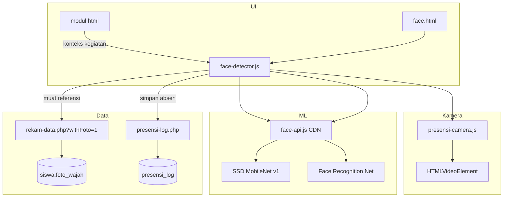
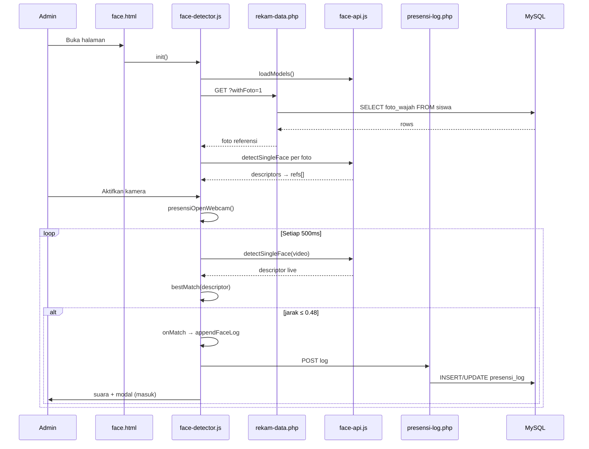

# Panduan Face Detector — Absensi Wajah

Dokumen ini menjelaskan cara kerja modul **Face Detector** di `admin/modules/face.html`: bagaimana sistem mendeteksi wajah dari kamera, mencocokkannya dengan foto referensi siswa di database, lalu mencatat absensi masuk/keluar ke tabel `presensi_log`.

Dokumen ini melengkapi [`REKAM-WAJAH.md`](./REKAM-WAJAH.md) — foto referensi harus sudah direkam terlebih dahulu sebelum modul absen bisa digunakan.

---

## Ringkasan alur

```
[Halaman modul.html]
  Pilih unit / jenjang / kelas + catatan kegiatan
  → disimpan di localStorage (presensi_modul_context)
      │
      ▼
[face.html — inisialisasi]
  1. Muat model face-api.js (SSD, landmarks, recognition)
  2. GET rekam-data.php?withFoto=1 → foto referensi siswa aktif
  3. Ekstrak face descriptor per foto → simpan di memori (refs[])
  4. Muat log presensi hari ini dari presensi_log
      │
      ▼
[User tekan "Aktifkan kamera"]
  presensiOpenWebcam() → stream ke <video>
  setInterval(runDetect, 500ms)
      │
      ▼
[Setiap 500ms — runDetect]
  detectSingleFace(video) → descriptor live
  bandingkan euclideanDistance vs semua refs[]
  jika jarak ≤ 0.48 → MATCH
      │
      ▼
[onMatch — cooldown 5 detik per siswa]
  • Ucapan suara nama siswa (speechSynthesis)
  • appendFaceLog → masuk ATAU update keluar
  • Modal konfirmasi (hanya saat masuk pertama)
  • POST presensi-log.php → tabel presensi_log
```

---

## Prasyarat

Sebelum modul absen berfungsi:

| Prasyarat | Keterangan |
|-----------|------------|
| Foto referensi | Siswa `aktif = 1` dan punya `foto_wajah` di tabel `siswa` (lihat REKAM-WAJAH.md) |
| Koneksi internet | Untuk memuat library `face-api.js` dan model weights (sekali per sesi) |
| HTTPS / localhost | Browser memerlukan secure context untuk akses kamera |
| API aktif | `PresensiApiConfig.enabled = true` agar log tersimpan ke database |
| Konteks modul | Unit, jenjang, kelas dipilih di `modul.html` sebelum masuk Face Detector |

---

## Arsitektur komponen



### File utama

| File | Peran |
|------|-------|
| `admin/modules/face.html` | Halaman UI: video, toolbar, tabel log |
| `admin/js/face-detector.js` | Logika deteksi, matching, absensi |
| `admin/js/presensi-camera.js` | Helper buka webcam (`presensiOpenWebcam`) |
| `admin/js/presensi-masuk-modal.js` | Dialog konfirmasi saat masuk pertama |
| `admin/js/rekam-service.js` | Ambil foto referensi dari DB |
| `admin/api/presensi-api.js` | Client wrapper `savePresensiLog` / `listPresensiLog` |
| `admin/api/presensi-log.php` | API simpan/baca log absensi |
| `admin/api/lib/PresensiRepository.php` | Query ke tabel `presensi_log` |
| `admin/js/modul-context.js` | Simpan konteks unit/jenjang/kelas/kegiatan |

### Library eksternal

Dimuat di `face.html`:

```html
<script src="https://cdn.jsdelivr.net/npm/face-api.js@0.22.2/dist/face-api.min.js"></script>
```

Model weights diunduh dari:

```
https://cdn.jsdelivr.net/gh/justadudewhohacks/face-api.js@0.22.2/weights
```

Tiga model yang dipakai:
- `ssdMobilenetv1` — deteksi lokasi wajah
- `faceLandmark68Net` — landmark wajah
- `faceRecognitionNet` — embedding/descriptor untuk pencocokan

---

## Konstanta penting

Didefinisikan di `face-detector.js`:

| Konstanta | Nilai | Fungsi |
|-----------|-------|--------|
| `MATCH_THRESHOLD` | `0.48` | Batas jarak Euclidean; semakin kecil = semakin mirip |
| `COOLDOWN_MS` | `5000` | Jeda minimal antar pencatatan absen per siswa (ms) |
| `DETECT_MS` | `500` | Interval deteksi wajah dari kamera (ms) |
| `minConfidence` (live) | `0.45` | Keyakinan deteksi wajah di video |
| `minConfidence` (referensi) | `0.4` | Keyakinan deteksi wajah di foto referensi |
| `MAX_LOG_ROWS` | `30` | Maks baris log di UI (mode offline) |
| `DEFAULT_KEGIATAN` | `"Presensi harian"` | Nama kegiatan default jika catatan kosong |

---

## Tahap 1 — Inisialisasi halaman

Saat `face.html` dibuka, `init()` di `face-detector.js` menjalankan:

### 1.1 Muat log presensi hari ini

```javascript
window.PresensiApiExtras.listPresensiLog({
  limit: 200,
  date: todayDateKey(),        // "YYYY-MM-DD"
  kegiatan: getKegiatanPresensi() // dari localStorage modul context
});
```

Jika API tidak aktif, log dibaca dari `localStorage` key `presensi_face_log`.

### 1.2 Sinkron data siswa (opsional)

Jika `PresensiData.isRemote()`:

```javascript
window.PresensiData.pullAll().then(bootModels);
```

Ini memastikan cache siswa terbaru sebelum membangun referensi wajah.

### 1.3 Muat model ML + bangun referensi

```javascript
function loadModels() {
  return Promise.all([
    faceapi.nets.ssdMobilenetv1.loadFromUri(MODEL_URL),
    faceapi.nets.faceLandmark68Net.loadFromUri(MODEL_URL),
    faceapi.nets.faceRecognitionNet.loadFromUri(MODEL_URL),
  ]).then(function () {
    modelsReady = true;
    return buildRefs();
  });
}
```

### 1.4 Bangun indeks wajah referensi (`buildRefs`)

```javascript
function loadReferensiSiswa() {
  return window.PresensiRekamService.listWithFoto()
    .then(function (rows) {
      return rows.filter(function (s) {
        return s.fotoWajah && s.fotoWajah.length > 80;
      });
    });
}

// Untuk setiap siswa:
faceapi.fetchImage(siswa.fotoWajah)
  .then(function (img) {
    return faceapi
      .detectSingleFace(img, new faceapi.SsdMobilenetv1Options({ minConfidence: 0.4 }))
      .withFaceLandmarks()
      .withFaceDescriptor();
  })
  .then(function (det) {
    if (det && det.descriptor) {
      refs.push({ siswa: siswa, descriptor: det.descriptor });
    }
  });
```

**Penting:** Descriptor (vektor 128 dimensi) disimpan di memori browser, bukan di database. Database hanya menyimpan foto base64; descriptor dihitung ulang setiap kali halaman dimuat.

---

## Tahap 2 — Aktivasi kamera

Tombol **Aktifkan kamera** memanggil `startCamera()`:

```javascript
window.presensiOpenWebcam(vid).then(function (s) {
  stream = s;
  detectTimer = window.setInterval(runDetect, DETECT_MS);
});
```

`presensi-camera.js` mencoba beberapa constraint `getUserMedia` secara berurutan (facingMode user → resolusi ideal → fallback `video: true`) agar kompatibel di desktop, laptop, dan Safari.

---

## Tahap 3 — Deteksi & pencocokan wajah

### 3.1 Deteksi dari video live

```javascript
function runDetect() {
  faceapi
    .detectSingleFace(vid, new faceapi.SsdMobilenetv1Options({ minConfidence: 0.45 }))
    .withFaceLandmarks()
    .withFaceDescriptor()
    .then(function (res) {
      if (!res || !res.descriptor) {
        hideFaceTarget();
        return;
      }
      var m = bestMatch(res.descriptor);
      if (m) {
        onMatch(m.ref.siswa, m.distance);
        updateFaceTarget(vid, res.detection.box, m.ref.siswa.nama);
      } else {
        updateFaceTarget(vid, res.detection.box, null);
      }
    });
}
```

### 3.2 Algoritma pencocokan

```javascript
function bestMatch(descriptor) {
  var best = null;
  var bestD = Infinity;
  for (var i = 0; i < refs.length; i++) {
    var d = faceapi.euclideanDistance(descriptor, refs[i].descriptor);
    if (d < bestD) {
      bestD = d;
      best = refs[i];
    }
  }
  if (!best || bestD > MATCH_THRESHOLD) return null;
  return { ref: best, distance: bestD };
}
```

**Cara membaca jarak:**
- `0.0` = identik sempurna (jarang di dunia nyata)
- `< 0.48` = dianggap cocok (siswa dikenali)
- `> 0.48` = tidak cocok (wajah tidak dikenali)

### 3.3 Overlay target wajah

Kotak hijau (`face-target-box`) mengikuti posisi wajah di video. Jika cocok, nama siswa ditampilkan di dalam kotak. Video menggunakan efek cermin (`scaleX(-1)`), sehingga koordinat dihitung ulang di `mapFaceBoxToOverlayPixels()`.

---

## Tahap 4 — Pencatatan absensi (masuk / keluar)

### 4.1 Cooldown per siswa

```javascript
function canAnnounce(siswaId) {
  var t = Date.now();
  var prev = lastAnnounceById[siswaId] || 0;
  if (t - prev < COOLDOWN_MS) return false;  // 5 detik
  lastAnnounceById[siswaId] = t;
  return true;
}
```

Mencegah satu siswa tercatat berulang kali dalam hitungan detik.

### 4.2 Logika masuk vs keluar

**Satu baris per siswa per hari kalender per kegiatan:**

| Deteksi | Kondisi | Aksi |
|---------|---------|------|
| **Masuk** | Belum ada log hari ini untuk siswa + kegiatan | Buat baris baru, set `waktuMasuk`, tampilkan modal |
| **Keluar** | Sudah ada log hari ini untuk siswa + kegiatan | Update `waktuKeluar` pada baris yang sama |

```javascript
function appendFaceLog(siswa, metode) {
  var now = new Date().toISOString();
  var keg = getKegiatanPresensi();
  var idx = findPresensiRowToday(logs, siswa.id, kegNorm);

  if (idx !== -1) {
    // Sudah masuk hari ini → catat KELUAR
    row.waktuKeluar = now;
  } else {
    // Belum masuk hari ini → catat MASUK
    logs.unshift({
      id: newFaceLogId(),
      waktuMasuk: now,
      waktuKeluar: null,
      siswaId: siswa.id,
      nama: siswa.nama,
      nis: siswa.nis,
      kegiatan: keg,
      metode: "face recognition",
    });
    window.presensiShowMasukModal({ nama: siswa.nama, nis: siswa.nis });
  }
}
```

### 4.3 Umpan balik ke pengguna

Saat match berhasil (dan cooldown terpenuhi):

1. **Suara** — `speechSynthesis`: *"Presensi wajah berhasil. [Nama siswa]."*
2. **Animasi** — pulse pada area video
3. **Modal** — hanya saat **masuk pertama** kali per hari
4. **Tabel log** — kolom Masuk / Keluar diperbarui

### 4.4 Nama kegiatan presensi

Diambil dari `localStorage` key `presensi_modul_context`, field `catatan`:

```javascript
function getKegiatanPresensi() {
  var data = JSON.parse(localStorage.getItem("presensi_modul_context"));
  return data.catatan || "Presensi harian";
}
```

Konteks ini diisi di `modul.html` saat admin memilih unit, jenjang, kelas, dan catatan kegiatan sebelum membuka modul.

---

## Penyimpanan ke database

### Tabel `presensi_log`

```sql
CREATE TABLE presensi_log (
  id BIGINT UNSIGNED NOT NULL AUTO_INCREMENT,
  log_uid VARCHAR(64) NOT NULL,          -- ID unik log (dari frontend)
  siswa_id VARCHAR(64) NOT NULL,
  nis VARCHAR(32) NOT NULL DEFAULT '',
  nama VARCHAR(255) NOT NULL DEFAULT '',
  unit_label VARCHAR(255) NOT NULL DEFAULT '',
  kelas_label VARCHAR(255) NOT NULL DEFAULT '',
  kegiatan VARCHAR(255) NOT NULL DEFAULT '',
  metode VARCHAR(64) NOT NULL DEFAULT 'face recognition',
  waktu_masuk DATETIME NULL,
  waktu_keluar DATETIME NULL,
  created_at DATETIME NOT NULL DEFAULT CURRENT_TIMESTAMP,
  PRIMARY KEY (id),
  UNIQUE KEY uk_presensi_log_uid (log_uid)
);
```

### API endpoint

| Method | URL | Fungsi |
|--------|-----|--------|
| `GET` | `/admin/api/presensi-log.php?date=YYYY-MM-DD&kegiatan=...&limit=200` | Daftar log |
| `POST` | `/admin/api/presensi-log.php` | Simpan/update log |

### Contoh request simpan absen

```http
POST /admin/api/presensi-log.php
Content-Type: application/json

{
  "id": "face-log-1719750000000-abc123",
  "siswaId": "mm-220007",
  "nis": "220007",
  "nama": "Ahmad Fauzi",
  "kegiatan": "Presensi harian sesi pagi",
  "metode": "face recognition",
  "waktuMasuk": "2025-06-30T07:15:00.000Z",
  "waktuKeluar": null
}
```

Saat siswa terdeteksi lagi (keluar), body yang sama dikirim dengan `waktuKeluar` terisi. Backend memakai `ON DUPLICATE KEY UPDATE` berdasarkan `log_uid`:

```php
$sql = 'INSERT INTO presensi_log (...)
        VALUES (...)
        ON DUPLICATE KEY UPDATE
            waktu_masuk = COALESCE(VALUES(waktu_masuk), waktu_masuk),
            waktu_keluar = VALUES(waktu_keluar)';
```

### Contoh `curl`

```bash
# Baca log hari ini
curl -s "https://domain-anda.com/admin/api/presensi-log.php?date=2025-06-30&kegiatan=Presensi%20harian&limit=50"

# Simpan absen masuk
curl -s -X POST "https://domain-anda.com/admin/api/presensi-log.php" \
  -H "Content-Type: application/json" \
  -d '{
    "id": "face-log-test-001",
    "siswaId": "mm-220007",
    "nis": "220007",
    "nama": "Ahmad Fauzi",
    "kegiatan": "Presensi harian",
    "metode": "face recognition",
    "waktuMasuk": "2025-06-30T07:15:00.000Z"
  }'
```

### Contoh kode frontend — simpan log

```javascript
// Dari face-detector.js
window.PresensiApiExtras.savePresensiLog({
  id: "face-log-...",
  siswaId: siswa.id,
  nis: siswa.nis,
  nama: siswa.nama,
  kegiatan: getKegiatanPresensi(),
  metode: "face recognition",
  waktuMasuk: new Date().toISOString(),
  waktuKeluar: null,
});
```

### Contoh kode backend (PHP)

```php
// presensi-log.php
$repo = new PresensiRepository();
$result = $repo->saveLog($body);
api_json($result);

// PresensiRepository::saveLog()
$this->pdo->prepare($sql)->execute([
    ':log_uid'       => $logUid,
    ':siswa_id'      => $payload['siswaId'],
    ':nis'           => $payload['nis'],
    ':nama'          => $payload['nama'],
    ':kegiatan'      => $payload['kegiatan'] ?? '',
    ':metode'        => $payload['metode'] ?? 'face recognition',
    ':waktu_masuk'   => $this->normalizeDateTime($payload['waktuMasuk']),
    ':waktu_keluar'  => $this->normalizeDateTime($payload['waktuKeluar']),
]);
```

---

## Alur penggunaan (admin)

1. **Rekam foto wajah** siswa di Pengaturan → Rekam data (lihat REKAM-WAJAH.md).
2. Buka **Modul** → pilih unit, jenjang, kelas, dan catatan kegiatan.
3. Klik **Face Detector** → tunggu model & referensi siap.
4. Tekan **Aktifkan kamera** → izinkan akses webcam.
5. Siswa menghadap kamera:
   - Deteksi pertama hari itu → **masuk** (modal + suara + log).
   - Deteksi berikutnya (setelah cooldown 5 detik) → **keluar** (update log).
6. Log tampil di panel kanan (desktop) dan tersimpan di `presensi_log`.

Tombol **Muat ulang data wajah** berguna setelah ada siswa baru direkam fotonya tanpa refresh halaman penuh.

---

## Mode offline vs online

| Aspek | API aktif (`enabled: true`) | API nonaktif |
|-------|----------------------------|--------------|
| Foto referensi | `GET rekam-data.php?withFoto=1` | `localStorage` `presensi_data_siswa` |
| Log absensi | `presensi_log` (MySQL) | `localStorage` `presensi_face_log` |
| Foto di cache | Base64 **tidak** disimpan di localStorage (hemat kuota) | Hanya siswa yang pernah di-cache |

**Catatan:** Mode remote **wajib** ambil foto langsung dari server karena cache localStorage sengaja membuang base64.

---

## Diagram sequence lengkap



---

## Membangun project serupa — checklist

1. **Rekam wajah dulu** — simpan foto referensi per siswa (base64 atau file storage).
2. **Pilih library ML** — sistem ini memakai `face-api.js` (berbasis TensorFlow.js).
3. **Pre-compute atau on-the-fly** — hitung face descriptor saat halaman dimuat (seperti `buildRefs`).
4. **Loop deteksi** — `setInterval` pada stream kamera, jangan blok UI thread.
5. **Threshold tuning** — mulai dari `0.48`, sesuaikan false positive/negative.
6. **Cooldown** — cegah double-scan dalam beberapa detik.
7. **Logika masuk/keluar** — definisikan aturan (per hari, per sesi, dll.).
8. **Persist log** — API + tabel `presensi_log` dengan `waktu_masuk` / `waktu_keluar`.
9. **UX** — modal, suara, overlay kotak wajah meningkatkan kepercayaan operator.

---

## Troubleshooting

| Gejala | Kemungkinan penyebab | Solusi |
|--------|---------------------|--------|
| "Belum ada foto referensi" | Tidak ada siswa aktif berfoto | Rekam foto di Pengaturan → Rekam data |
| "face-api.js gagal dimuat" | Tidak ada internet | Pastikan CDN dapat diakses |
| Wajah terdeteksi tapi tidak dikenali | Foto buruk / pencahayaan berbeda | Rekam ulang foto, turunka threshold (hati-hati false match) |
| False match (siswa salah) | Threshold terlalu longgar | Naikkan `MATCH_THRESHOLD` (mis. 0.42) |
| Kamera tidak bisa dibuka | Bukan HTTPS, izin ditolak | Gunakan HTTPS, cek permission browser |
| Log tidak masuk DB | API disabled / error 500 | Cek `config.php`, `health.php?setup=1` |
| Descriptor gagal dari foto | Wajah tidak terbaca di foto referensi | Ganti foto — wajah frontal, terang, tanpa masker |
| Modal tidak muncul | Bukan deteksi masuk pertama | Normal — modal hanya untuk masuk pertama per hari |
| Tombol reload tidak cukup | Model sudah stale | Refresh halaman penuh |

---

## Perbedaan Face Detector vs FacePay

| | Face Detector (`face.html`) | FacePay (`facepay.html`) |
|--|----------------------------|--------------------------|
| Tujuan | Absensi masuk/keluar | Pembayaran / debit saldo |
| Output | `presensi_log` | Transaksi saldo + log FacePay |
| Verifikasi tambahan | Tidak | Telapak tangan terbuka (MediaPipe Hands) |
| File JS | `face-detector.js` | `facepay.js` |

Keduanya memakai `face-api.js` dan foto referensi dari `rekam-data.php?withFoto=1`, tetapi logika setelah match berbeda.

---

## File terkait di repository

```
admin/
  modules/face.html              # Halaman absensi wajah
  js/
    face-detector.js             # Inti logika deteksi & absen
    presensi-camera.js           # Helper webcam
    presensi-masuk-modal.js      # Modal konfirmasi masuk
    rekam-service.js             # Ambil foto referensi
    modul-context.js             # Konteks unit/kelas/kegiatan
    presensi-data-service.js     # Sync cache siswa
  api/
    presensi-log.php             # API log absensi
    presensi-api.js              # Client wrapper
    rekam-data.php               # Sumber foto referensi (?withFoto=1)
    lib/PresensiRepository.php   # Query presensi_log
  database/schema.sql            # Skema tabel presensi_log

docs/
  REKAM-WAJAH.md                 # Panduan rekam foto referensi
  FACE-DETECTOR-ABSEN.md         # Dokumen ini
```

---

*Dokumen ini mengacu pada implementasi di repository `batu_alizzah_face`. Sesuaikan threshold, interval deteksi, dan aturan masuk/keluar dengan kebutuhan operasional sekolah Anda.*
